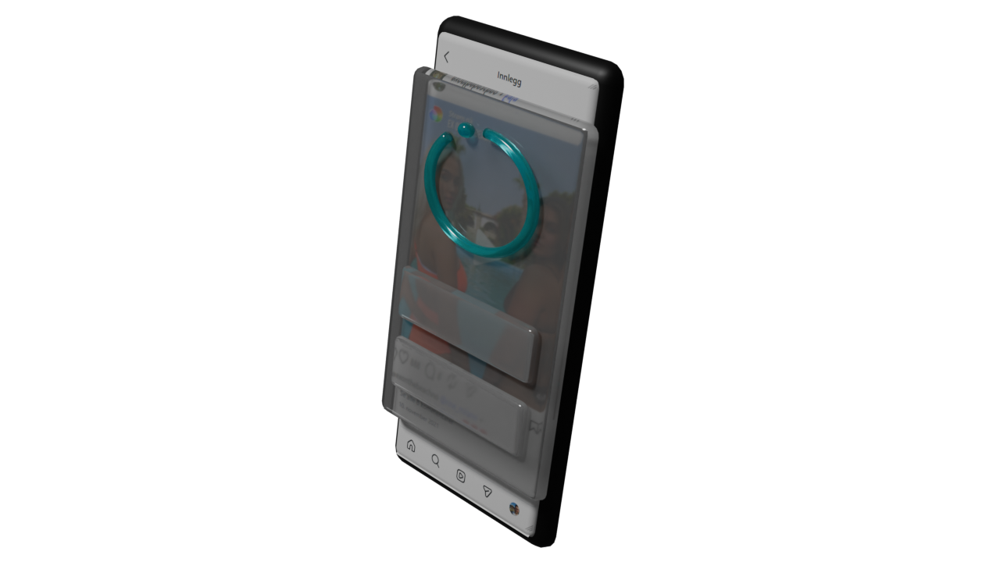
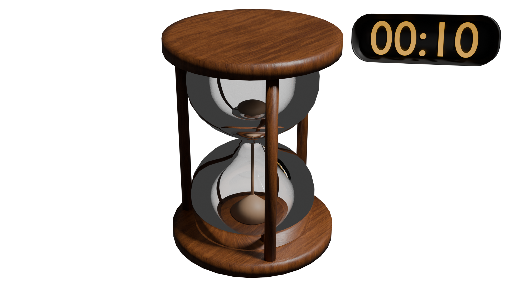
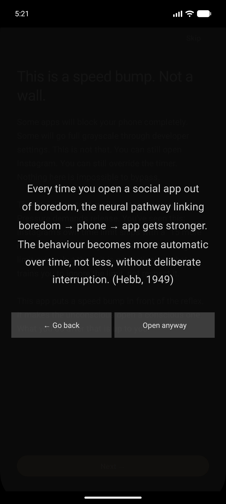
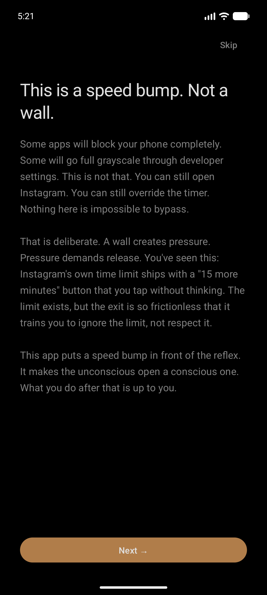
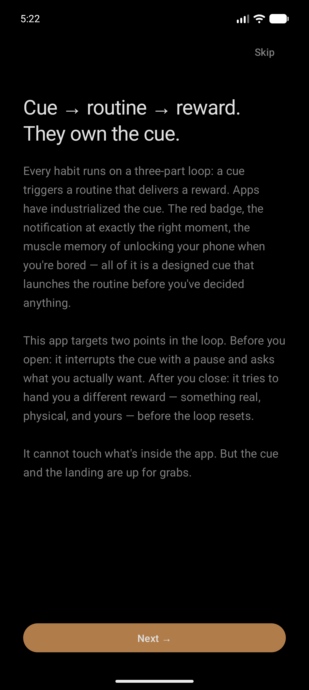
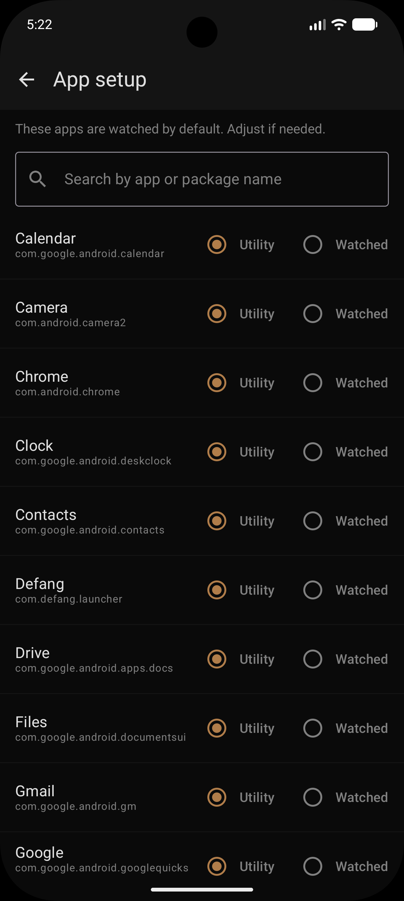
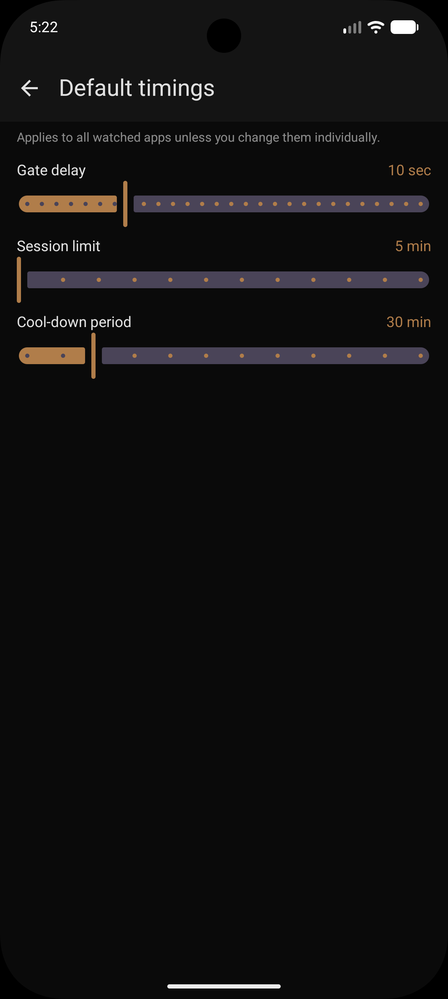
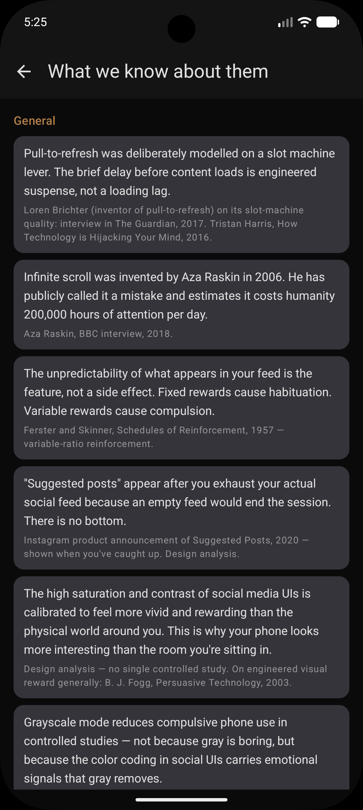
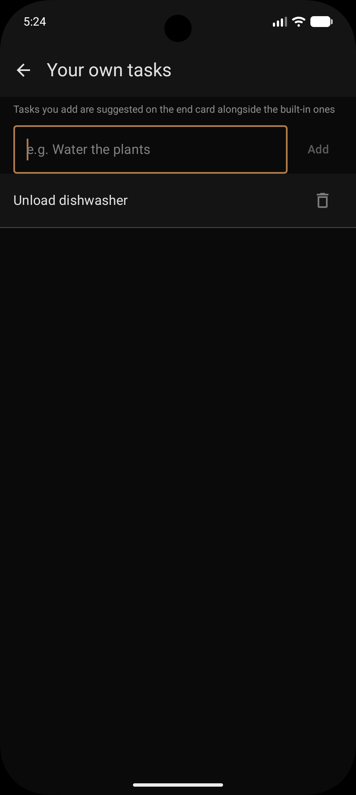
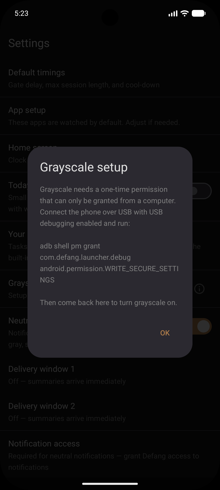

# Defang

> Android launcher that adds friction to apps that exploit your attention.


Social media apps are engineered to pull you in without asking. Defang puts a speed bump between you and the mindless scroll: before any watched app opens, you declare your intent, wait out a short countdown, and decide if this is actually how you want to spend the next $n$ minutes.

---

## How it works

**Intent gate** — When you open a watched app (Instagram, TikTok, YouTube, etc.), a full-screen overlay appears before the app opens. You read the tidbit about how they manipulate you and get on with better stuff to do — or you wait out an 10-second countdown before you can open it anyway.



**Session timer** — Once you're in the app, a small HUD counts down your session limit (default 15 min). When it hits zero, the app is automatically pushed to background.



**End card** — At session end you see how long you were in, a friction prompt to reflect, and the option to extend once per day — with a minimum 10-character written justification.

**Cool-down** — After your session (or extension) ends, the app is locked for a cool-down period (default 30 min).


---

## Screenshots

| Intent gate | Onboarding | Setup | Watched apps |
|:---:|:---:|:---:|:---:|
|  |  |  |  |

| Timings | Tidbit library | Your own tasks | Grayscale setup |
|:---:|:---:|:---:|:---:|
|  |  |  |  |

---

## Watched apps (defaults)

Instagram, Snapchat, TikTok, Reddit, X/Twitter, Facebook, YouTube, Tinder, Bumble, Hinge, OkCupid, Grindr, Badoo, Match, Happn, Meetic.

All defaults can be changed in Settings → Watched apps.

---

## Setup

1. Install the APK or build from source (see below).
2. Set Defang as your default launcher when prompted.
3. Grant **Display over other apps** permission (required for overlays).
4. Enable **Defang** under Settings → Accessibility → Installed services (required for foreground app detection).

Steps 3 and 4 are prompted automatically on first launch.

---

## Build from source

Requirements: Android Studio Ladybug or later, JDK 17, Android SDK 35.

```bash
git clone https://github.com/Scandiking/Defang.git
cd Defang
./gradlew assembleDebug
```

Install on a connected device:

```bash
./gradlew installDebug
```

- `minSdk` 26 (Android 8.0)
- `targetSdk` 35

---

## Tech stack

- Kotlin + Jetpack Compose (launcher and settings UI)
- View-based overlays (intent gate, HUD, end card — run inside AccessibilityService, no Activity lifecycle)
- Room (session and app config persistence)
- DataStore (onboarding state, daily extension tracking)
- Hilt (dependency injection)
- AccessibilityService (foreground app detection via `TYPE_WINDOW_STATE_CHANGED`)

---

## Project structure

```
app/src/main/kotlin/com/defang/launcher/
├── data/          # Room entities, DAOs, DataStore, repositories
├── domain/        # Models, use cases
├── service/
│   ├── accessibility/   # DefangAccessibilityService — core event loop
│   └── overlay/         # IntentGateOverlay, SessionTimerOverlay, EndCardOverlay
├── ui/
│   ├── launcher/        # Home screen / app drawer
│   ├── onboarding/      # 5-screen first-run flow
│   └── settings/        # App tier config
└── util/          # TidbitSelector, OfflinePromptSelector
```

---

## Roadmap

**Phase 1 (current)**
- Intent gate with countdown and declared-purpose cards
- Session timer HUD
- End card with extension friction
- Cool-down lockout

**Phase 2 (planned)**
- Notification batching — hold notifications from watched apps and deliver them on a schedule
- Grayscale overlay during sessions
- Usage stats and weekly report
- Widget for daily session summary

---

## Philosophy

Defang is not a blocker. It does not stop you from using your phone the way you want. It adds one deliberate pause — enough to make the choice conscious rather than automatic. The friction is the feature.

---

## License

GPLv3
