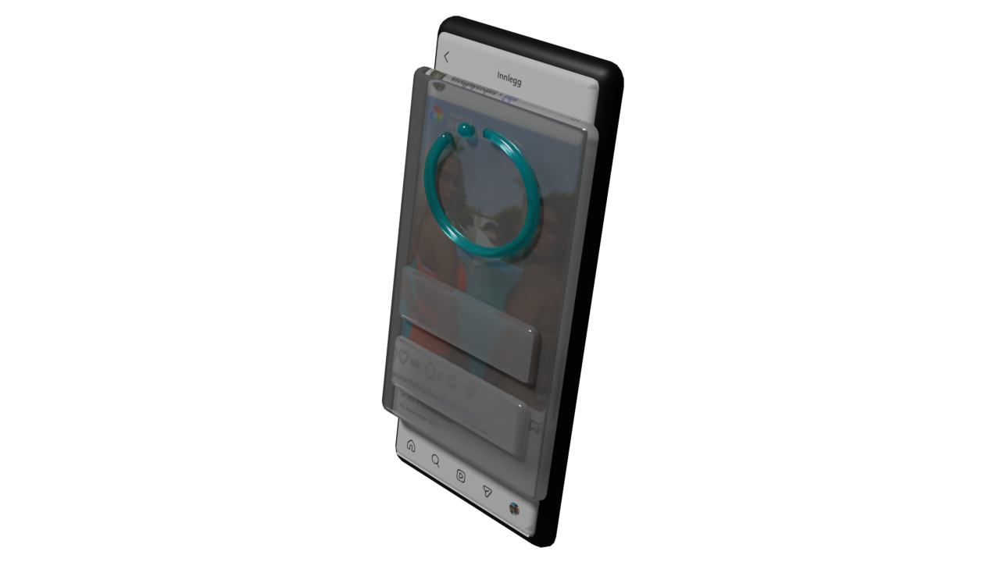
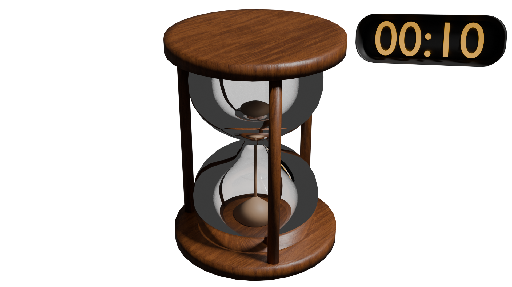
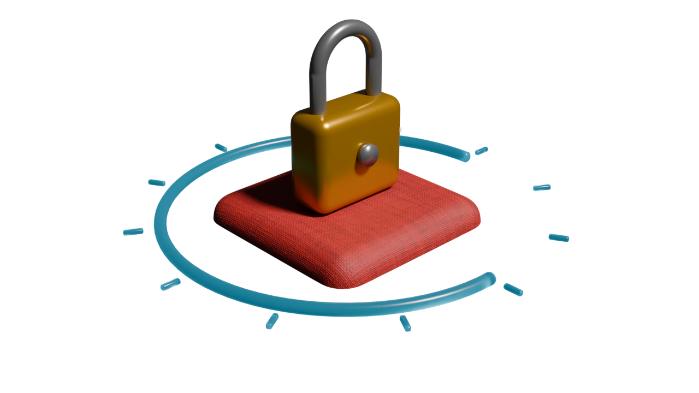
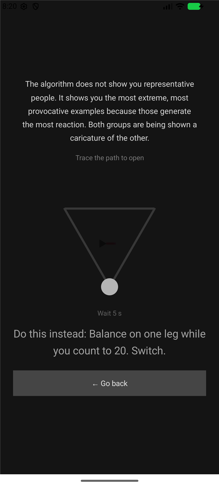
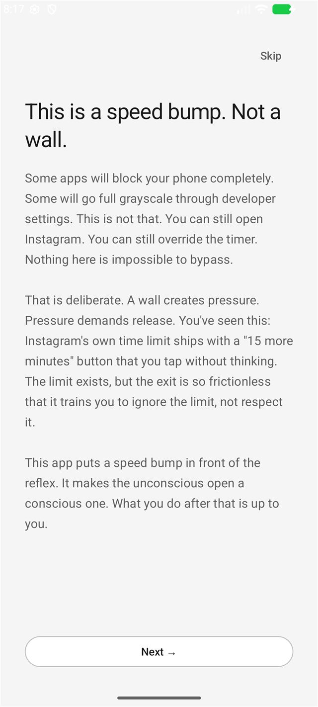
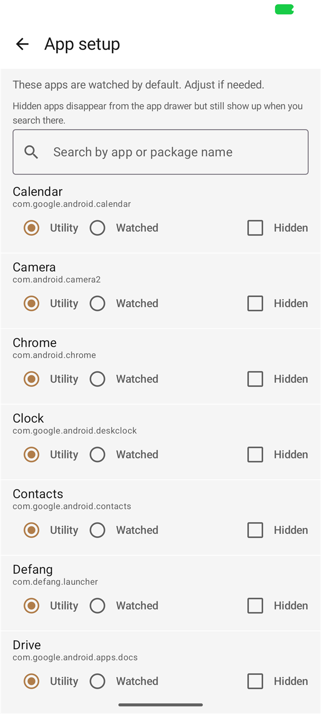
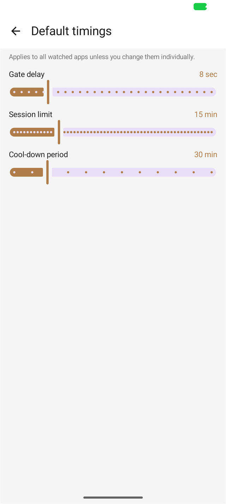
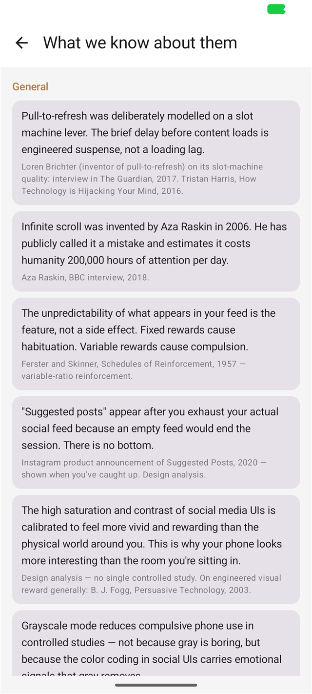
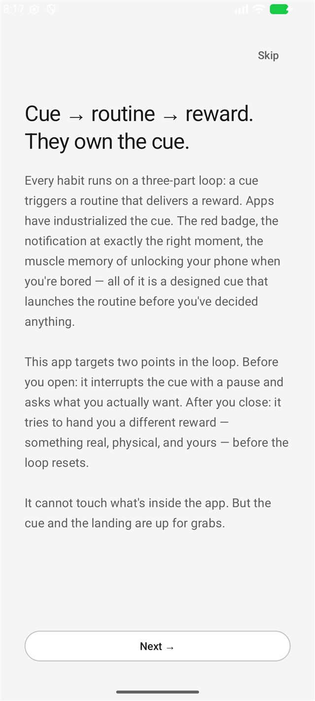

# Defang

> Android launcher that adds friction to apps that exploit your attention.

<picture>
  <source media="(prefers-color-scheme: dark)" srcset="assets/Defang_logo.png">
  
</picture>

Social media apps are engineered to pull you in without asking. Defang puts a speed bump between you and the infinite mindless scroll: before any watched app opens, you wait out a short countdown, and decide if this is actually how you want to spend the next $n$ minutes. De-FAANG your phone use, regain your life.

[](https://f-droid.org/packages/com.defang.launcher/)

---

## How it works  

**Intent gate**  

  

When you open a watched app (Instagram, TikTok, YouTube, etc.), a full-screen overlay appears before the app opens. You read the tidbit about how they manipulate you and get on with better stuff to do or you wait out an $n$-second countdown before you can open it anyway.

**Session timer**  

  

Once you're in the app, a small HUD counts down your session limit (default 15 min). When it hits zero, the app is automatically pushed to background.

**End card**  
At session end you see how long you were in, a friction prompt to reflect. Then you are urged with a mini-task. The task is written this way to make it easy to actually follow through with.

**Cool-down lock**  

  
    
After your session (or extension) ends, the app is locked for a cool-down period (default 30 min). The cue-reward-path runs on a loop you know. So this is to weaken the loop. 


---

## Screenshots

Screens follow your system theme — shown here in light and dark (switch global theme to see the opposite).

| Intent gate | Onboarding | Watched apps |
|:---:|:---:|:---:|
| <picture><source media="(prefers-color-scheme: dark)" srcset="assets/Screenshots/intent_gate_dark.png"></picture> | <picture><source media="(prefers-color-scheme: dark)" srcset="assets/Screenshots/onboarding_dark.png"></picture> | <picture><source media="(prefers-color-scheme: dark)" srcset="assets/Screenshots/watched_apps_dark.png"></picture> |

| Timings | Tidbit library | Cue loop |
|:---:|:---:|:---:|
| <picture><source media="(prefers-color-scheme: dark)" srcset="assets/Screenshots/timer_adjustment_dark.png"></picture> | <picture><source media="(prefers-color-scheme: dark)" srcset="assets/Screenshots/tidbit_library_dark.png"></picture> | <picture><source media="(prefers-color-scheme: dark)" srcset="assets/Screenshots/cue_loop_dark.png"></picture> |

---

## Watched apps (defaults)
There are set some defaults.

Instagram, Snapchat, TikTok, Reddit, X/Twitter, Facebook, YouTube, Tinder, Bumble, Hinge, OkCupid, Grindr, Badoo, Match, Happn, Meetic.

Some of you will use third-part clients or apps not in defaults. All defaults can be changed in Settings → Watched apps. 

---

## Tech stack

- Kotlin + Jetpack Compose (launcher and settings UI)
- View-based overlays (intent gate, HUD, end card: run inside AccessibilityService, no Activity lifecycle)

> [!NOTE]  
> It runs in `AccessibilityService` so the watched app never leaves the foreground. The overlay floats on top of it instead of replacing it with a new screen. That means no relaunch needed to resume the app after unlock, and no back-stack/back-press escape route for the gate.

- Room (session and app config persistence)
- DataStore (onboarding state, daily extension tracking)
- Hilt (dependency injection)
- AccessibilityService (foreground app detection via `TYPE_WINDOW_STATE_CHANGED`)

---

## Project structure

```txt
app/src/main/kotlin/com/defang/launcher/
├── data/                   # Room entities, DAOs, DataStore, repositories
├── domain/                 # Models, use cases
├── service/
│   ├── accessibility/      # DefangAccessibilityService — core event loop
│   └── overlay/            # IntentGateOverlay, SessionTimerOverlay, EndCardOverlay
├── ui/
│   ├── launcher/           # Home screen / app drawer
│   ├── onboarding/         # 5-screen first-run flow
│   └── settings/           # App tier config
└── util/                   # TidbitSelector, OfflinePromptSelector
```

---

## Roadmap

### Shipped

- Intent gate — countdown plus slide-to-open, with a single clear warning that reflects how heavily you've used watched apps today
- Session timer HUD, auto-backgrounding the app at the limit
- End card with once-per-day extension friction (written justification required)
- Cool-down lockout after each session
- Grayscale applied *before* the app is revealed, so the feed never flashes in colour
- Weekly usage report — running totals per day and per app
- NFC tag unlock — scan a registered tag instead of the slide; secure ID-rotating cards are rejected, with a slide-to-open fallback if the scanner is blocked
- Live app drawer — reflects installs and uninstalls instantly; long-press for App info or to uninstall

### Planned / exploring

- More unlock methods alongside NFC and slide: scan a user-configured QR code or barcode ([#6](https://github.com/Scandiking/Defang/issues/6)), or solve a math problem ([#7](https://github.com/Scandiking/Defang/issues/7))
- Notification batching — hold notifications from watched apps and deliver them on a schedule
- Home-screen widget for the daily session summary
- Long-range usage trends — did watched-app time actually drop over the last 3/6/12 months, not just today/this week

---

## Philosophy

These platforms were sold to us as a way to connect with people. That is not what they are anymore. Facebook, Instagram, TikTok, X — they are advertising machines that happen to show you other humans when it keeps you scrolling. The feed isn't ordered by what matters to you; it's ordered by whatever keeps your thumb moving long enough to serve the next ad. The product is your attention, and it is sold by the hour. Every year the connective part gets thinner and the extractive part gets thicker — the platform enshittifies, and you get less while giving more.


The endpoint of that design is the *Wall-E* future; "shapeless humans": people reclined in a chair, screen an inch from their face, everything optimised and frictionless, nothing actually chosen. Comfortable, shapeless, no longer steering. Frictionless is the point, for them, the Silicon Valley industry. Every pause they remove is another moment you spend inside the app instead of deciding whether you meant to be there at all.

Defang is not a blocker. It does not stop you from using your phone the way you want. It puts back the one thing these apps spent billions removing: a single deliberate pause, enough to make the choice conscious rather than automatic. The friction is the feature.

---

## FAQ

**Why not block watched apps outright?**  
Blocking outright doesn't touch the underlying loop. Once the craving peaks, the user switches back to their old launcher, and often binges to make up for the FOMO. The loop fires exactly as before, just delayed. "Neurons that fire together, wire together" (Löwel & Singer, 1992): every uninterrupted cue→app→reward pass reinforces the same wiring. Defang instead inserts a pause *inside* the loop, every time, so the association weakens with repetition. Delayed gratification substituting for instant gratification, until the habit itself changes rather than just its timing.

**Why is the home screen so barren?**  
Novelty and visual stimulation are dopaminergic triggers in their own right (Bunzeck & Düzel, 2006: novel images alone activate the midbrain's reward circuitry, independent of any deliberate reward). A busy, engaging home screen would be one more novelty cue competing for attention before you've even opened an app. Defang keeps the screen deliberately inert, a tidbit and nothing more, so the phone gives you no reason to linger with it.

**Why are there no hints on the app drawer?**  
Habits run on environmental cues, not conscious intent (Wood & Neal, 2007). A visible app-drawer affordance is exactly that kind of cue, priming the swipe-up before you've decided you want to. "Swipe up" has been the unlabeled convention since the dedicated drawer icon disappeared from stock Android; Defang doesn't reintroduce a cue that convention already retired.

**Why isn't the lock screen blacked out too?**  
Android doesn't allow it — and not by oversight. The keyguard is a protected system surface owned by SystemUI; no public API lets a third-party app draw content above it or replace it while a secure lock (PIN/pattern/biometric) is active. That boundary was tightened deliberately: overlay windows sitting above sensitive system UI is a known attack surface for spoofing or capturing unlock input (Fratantonio et al., "Cloak & Dagger," 2017), so Android blocks exactly the kind of window Defang would need to cover the keyguard with a custom clock face. What Defang *can* do — and does — is apply grayscale as a display-level color filter rather than a window overlay; that operates beneath the compositor, on every pixel the screen emits, so it reaches the lock screen too without needing permission to draw on it.

> [!TIP]  
> You can get most of the way there yourself: in your lock screen settings, remove all widgets/shortcuts and set an all-black wallpaper. Combined with Defang's grayscale, that's as close to a blank lock screen as the OS permits any app, first- or third-party, to get you.

## License

GPLv3
